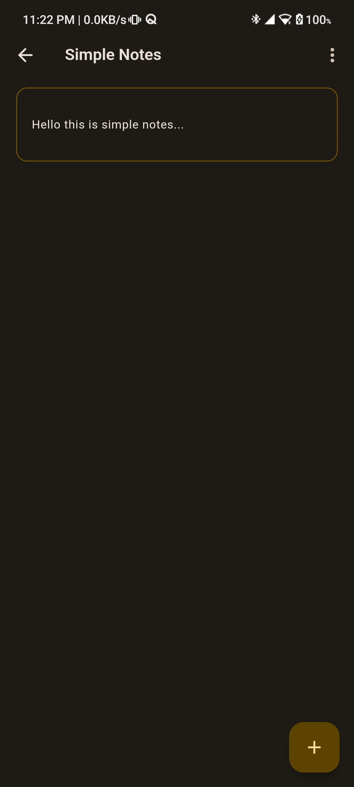
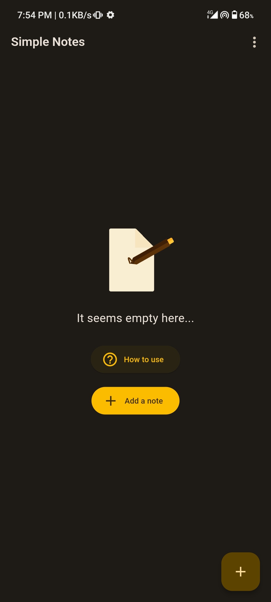

# Simple Notes

Simple Notes is a Flutter application that allows users to create, update, and delete notes. The app uses the Isar database for local storage and supports both Android and iOS platforms.

## Features

- Create new notes
- Update existing notes
- Delete notes
- Undo and redo actions
- Dark and light theme support
- FAQ and About sections

## Download

Download Simple Notes app from the [Google Play Store](https://play.google.com/store/apps/details?id=github.io.ramith_gunawardana.simple_notes)

## Getting Started

### Prerequisites

- Flutter SDK: [Install Flutter](https://flutter.dev/docs/get-started/install)
- Dart SDK: Included with Flutter
- Android Studio or VS Code for Android development or Xcode for iOS development

### Installation

1. Clone the repository:
   ```sh
   git clone https://github.com/Ramith-Gunawardana/simple_notes.git
   cd simple_notes
   ```
2. Install dependencies:
  ```sh
   flutter pub get
   ```
3. Generate Isar files:
  ```sh
   dart run build_runner build
   ```
4. Run the app:
  ```sh
   flutter run
   ```

### Building the App

To build the app for Android and iOS, use the following commands:
 - Android:
   ```sh
    flutter build apk
    ```
 - iOS:
   ```sh
    flutter build ios
    ```
   
## Dependencies

- [`flutter`](https://flutter.dev/): SDK for building Flutter applications
- [`isar`](https://pub.dev/packages/isar): Local database for Flutter
- [`path_provider`](https://pub.dev/packages/path_provider): Provides access to the file system
- [`provider`](https://pub.dev/packages/provider): State management library
- [`package_info_plus`](https://pub.dev/packages/package_info_plus): Provides package information
- [`url_launcher`](https://pub.dev/packages/url_launcher): Launches URLs in the browser

## Screenshots


<p>




</p>

## Contributing

Contributions are welcome! Please fork the repository and create a pull request with your changes.

## License

This project is licensed under the MIT License. See the [LICENSE](LICENSE) file for details.
